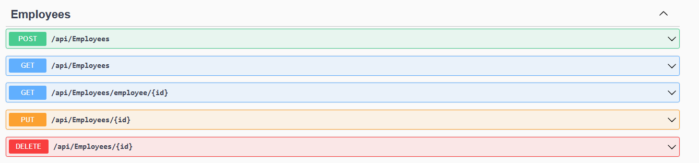
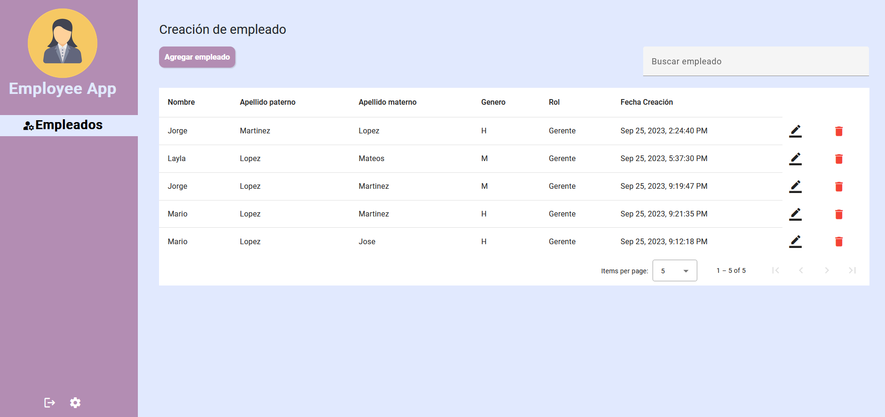
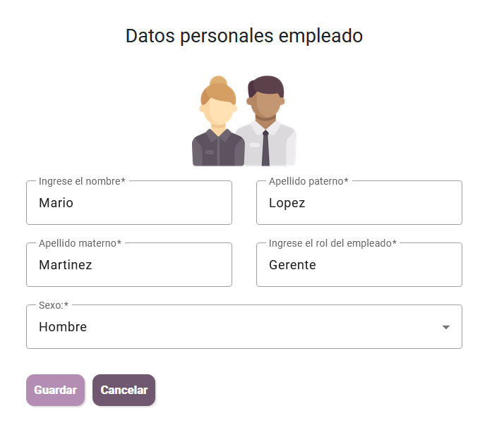
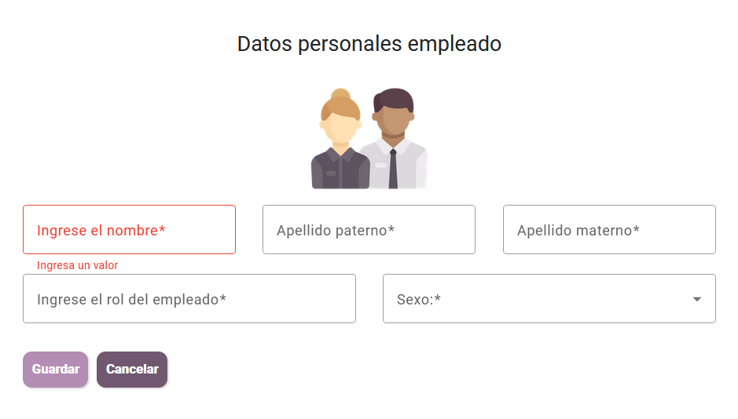

# Examen técnico
## Aplicación CRUD Empleados (Angular, C# + Sql Server)

### Keila Barranco Rosas


La aplicación solicitada cuenta con todas las acciones de un CRUD.
- Agregar empleado
- Eliminar empleado
- Editar los datos del empleado 
- Mostrar la lista de empleados agregados.
## Herramientas 
 - Angular CLI 16 
 - SQL Server 
## Installation

Ejecutar el siguiente script dentro de Sql Server: 

    CREATE DATABASE TestEmployeesDb;
    
    CREATE TABLE [dbo].[employee](
    	[id] [uniqueidentifier] NOT NULL,
    	[LastName] [varchar](50) NOT NULL,
    	[SecondLastname] [varchar](50) NOT NULL,
    	[Sexo] [varchar](2) NOT NULL,
    	[Rol] [varchar](50) NOT NULL,
    	[DateCreated] [datetime] NULL,
    	[Name] [varchar](50) NOT NULL,
    PRIMARY KEY CLUSTERED 
    (
    	[id] ASC
    )WITH (PAD_INDEX = OFF, STATISTICS_NORECOMPUTE = OFF, IGNORE_DUP_KEY = OFF, ALLOW_ROW_LOCKS = ON, ALLOW_PAGE_LOCKS = ON, OPTIMIZE_FOR_SEQUENTIAL_KEY = OFF) ON [PRIMARY]
    ) ON [PRIMARY]


	--Data inserts 

    INSERT INTO [dbo].[employee]
           ([id]
           ,[LastName]
           ,[SecondLastname]
           ,[Sexo]
           ,[Rol]
           ,[DateCreated]
           ,[Name]) VALUES(NEWID(),'Hernandez' 'Lopez','H','Gerente',GETDATE(),'Mario')

    INSERT INTO [dbo].[employee]
           ([id]
           ,[LastName]
           ,[SecondLastname]
           ,[Sexo]
           ,[Rol]
           ,[DateCreated]
           ,[Name]) VALUES(NEWID(),'Martinez','Sarmiento','H','Cajera',GETDATE(),'Jose')

	INSERT INTO [dbo].[employee]
           ([id]
           ,[LastName]
           ,[SecondLastname]
           ,[Sexo]
           ,[Rol]
           ,[DateCreated]
           ,[Name]) VALUES(NEWID(),'Lopez','Lopez','M','Administrador general',GETDATE(),'Ana')

	INSERT INTO [dbo].[employee]
           ([id]
           ,[LastName]
           ,[SecondLastname]
           ,[Sexo]
           ,[Rol]
           ,[DateCreated]
           ,[Name]) VALUES(NEWID(),'Mendoza','Lopez','M','Cajera',GETDATE(),'Maria')


### API Empleados

La Api se encuentra dentro de la carpeta Employees Services. 

Se debe sustituir dentro del archivo appsettings.json el nombre del usuario y contraseña de su ambiente local de base de datos. 

La aplicación debe estar ejecutandose en modo Debug para recibir las request desde el cliente. 

Los siguientes son los endpoints de la API: 



### Instalación de las dependencias dentro de la aplicación (Angular).

```sh
cd employee-app
npm i
ng serve
```

### Empleados
Al iniciar la aplicación se mostrara la pagina principal de empleados: 



Se muestra una tabla donde se enlistan todos los empleados registrados en la base de datos. 

Por cada empleado se agrego dos acciones: Editar y Eliminar. 

Al darle click al icono de Editar se mostrara un formulario con los datos de ese empleado listos para modificar. 


### Botón Agregar Empleados

El botón agregar empleado muestra un formulario para guardar un empleado.


Al agregar un nuevo empleado la tabla se actualiza mostrando al nuevo empleado agregado. 


